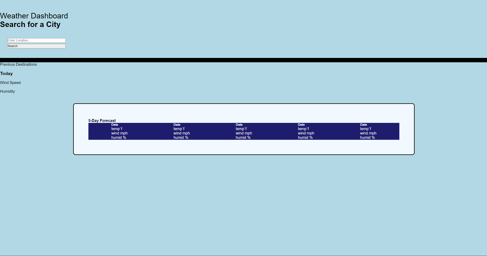

# 5 Day Weather Forecaster

## Description
The purpose of this project is to build a 5-day weather forecast app. The skills needed to execute this webpage well include linking and modifying external server side API's. In this case, we have utilized the Google weather API.

## Installation

N/A

## Usage

To access this project's deployed page, click this link!

To use this website, simply input a desired location you wish to see a 5-day forecast of the weather and press submit, or enter on your keyboard. You should then be faced with a 5-day forecast for that specific area as well as a tab for the current day's weather.

Along with the weather info, you should also see information on the humidity and wind speed.

## Credits

# Collaborators

UCONN Coding Bootcamp Student - Ronald Martin

UCONN Coding Bootcamp Instructor - Mia Ciasullo 

UCONN Coding Bootcamp Instructor - Lee Warrick

# Links to online resources

ChatGPT 3.5 - https://www.chat.openai.com/

Normalize CSS - https://blog.hubspot.com/website/normalize-css

MDN - https://developer.mozilla.org/en-US/

W3Schools - https://www.w3schools.com/

## License

MIT License. See project repo for more information concerning the license.
---